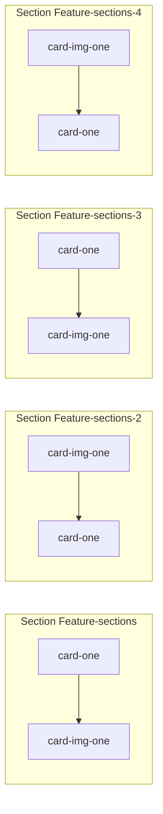
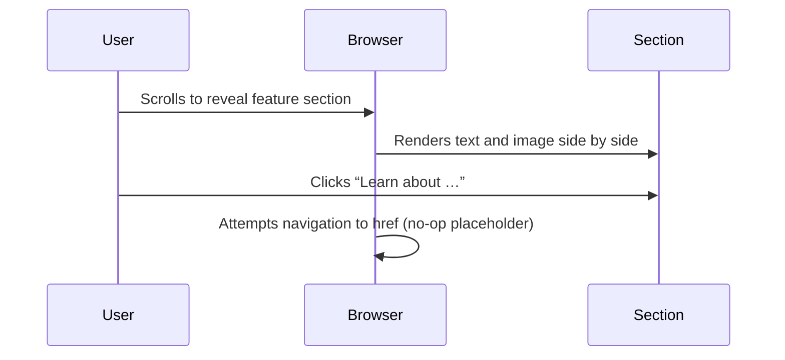

# Feature Sections Feature Documentation

## Overview

The Feature Sections of the Cursor landing page present four core product capabilities as alternating image-and-text cards. Each card highlights a distinct feature—agentic development, cloud-based parallelism, multi-surface integration, and advanced autocomplete—helping users quickly grasp Cursor’s value propositions. By alternating the placement of text and imagery, the design maintains visual interest and balances content flow as visitors scroll.

These static HTML sections use semantic `<section>` elements and simple CSS classes to structure content. They fit between the “Trusted by” and “Testimonials” areas on the single-page front end, reinforcing key messages before social proof and calls to action .

## Architecture Overview



## Component Structure

All four feature blocks share a common markup pattern:

```html
<section class="Feature-sections[-X]">
  <div class="card-layout">
    <div class="card-one">…text content…</div>
    <div class="card-img-one">
      
    </div>
  </div>
</section>
```

- **`Feature-sections`****, ****`Feature-sections-2`****, ****`Feature-sections-3`****, ****`Feature-sections-4`**: Section wrappers for cards 1–4.
- **`card-layout`**: Flex or grid container aligning text and image side by side.
- **`card-one`**: Text container holding the headline, supporting copy, and link.
- **`card-img-one`**: Image container wrapping the `` element.

## Feature Blocks

### 1. Section “Feature-sections” (Card 1)

- **Location**: `<section class="Feature-sections">` in `index.html`
- **Headline**:

Agents turn ideas into code

- **Supporting Copy**:

Accelerate development by handing off tasks to Cursor, while you focus on making decisions.

- **Link**:

Learn about agentic development →

- **Image Asset**:

`./assest/card-1.png`

### 2. Section “Feature-sections-2” (Card 2)

- **Location**: `<section class="Feature-sections-2">` in `index.html`
- **Image Asset**:

`./assest/card-2.png`

- **Headline**:

Works autonomously, runs in parallel

- **Supporting Copy**:

Agents use their own computers to build, test, and demo features end to end for you to review.

- **Link**:

Learn about cloud agents →

### 3. Section “Feature-sections-3” (Card 3)

- **Location**: `<section class="Feature-sections-3">` in `index.html`
- **Headline**:

In every tool, at every step

- **Supporting Copy**:

Cursor reviews your PRs in GitHub, collaborates in

Slack, and runs in your terminal.

- **Link**:

Learn about Cursor’s surfaces →

- **Image Asset**:

`./assest/card-3.png`

### 4. Section “Feature-sections-4” (Card 4)

- **Location**: `<section class="Feature-sections-4">` in `index.html`
- **Image Asset**:

`./assest/card-4.png`

- **Headline**:

Magically accurate autocomplete

- **Supporting Copy**:

Our specialized Tab model predicts your next action with striking speed and precision.

- **Link**:

Learn about Tab →

## Layout Alternation Pattern

- **Odd-numbered sections** (`Feature-sections`, `Feature-sections-3`): Text (`card-one`) appears first (left), image (`card-img-one`) second (right).
- **Even-numbered sections** (`Feature-sections-2`, `Feature-sections-4`): Image appears first (left), text second (right).

This alternation is achieved purely through the HTML order of child divs within `.card-layout` .

## User Interaction Flow

### Link Navigation

All “Learn about …” links use empty `href=""` placeholders. On a production build, these would route to detailed feature pages or anchor jumps. Currently, clicking a link triggers a full-page reload to the same URL.



## Testing Considerations

- **Content Verification**: Ensure each headline and supporting copy matches the specified text.
- **Image Loading**: Verify `card-1.png` through `card-4.png` load without 404 errors.
- **Layout Checks**: On desktop widths, confirm text/image order alternates correctly.
- **Accessibility**: Add meaningful `alt` attributes where needed (currently empty).

## Integration Points

These feature sections slot directly after the “Trusted by” logo grid and before the “Testimonials” carousel on the landing page. They serve as the primary product-highlighting zone in the user journey.

## CSS Classes Reference

| Class | Responsibility |
| --- | --- |
| Feature-sections | Wrapper for feature card 1 |
| Feature-sections-2 | Wrapper for feature card 2 |
| Feature-sections-3 | Wrapper for feature card 3 |
| Feature-sections-4 | Wrapper for feature card 4 |
| card-layout | Layout container aligning text and image |
| card-one | Text container (headline, copy, link) |
| card-img-one | Image container wrapping the `` element |


---

This documentation covers all four alternating feature blocks as implemented in `index.html` of the Cursor clone landing page .